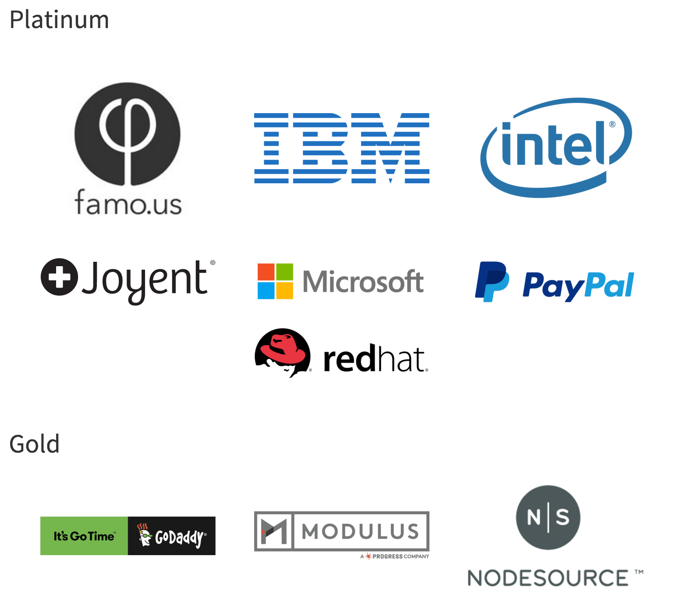
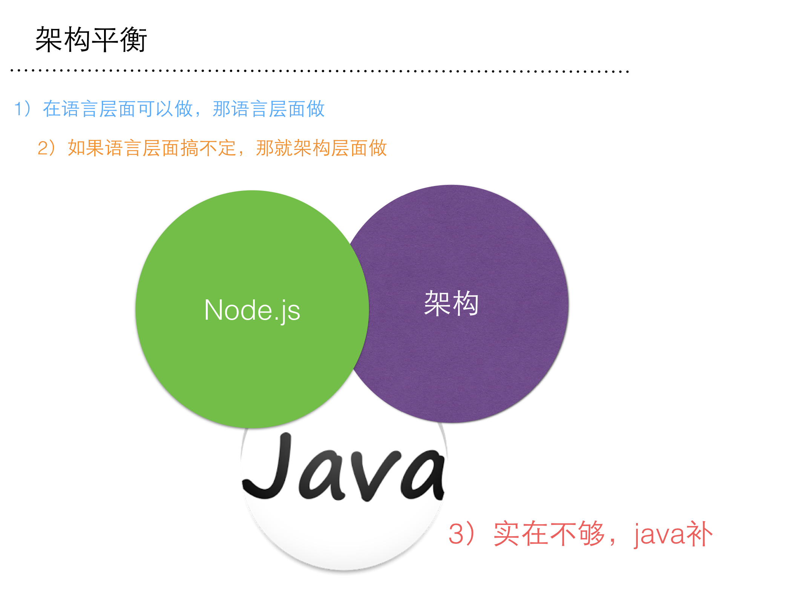
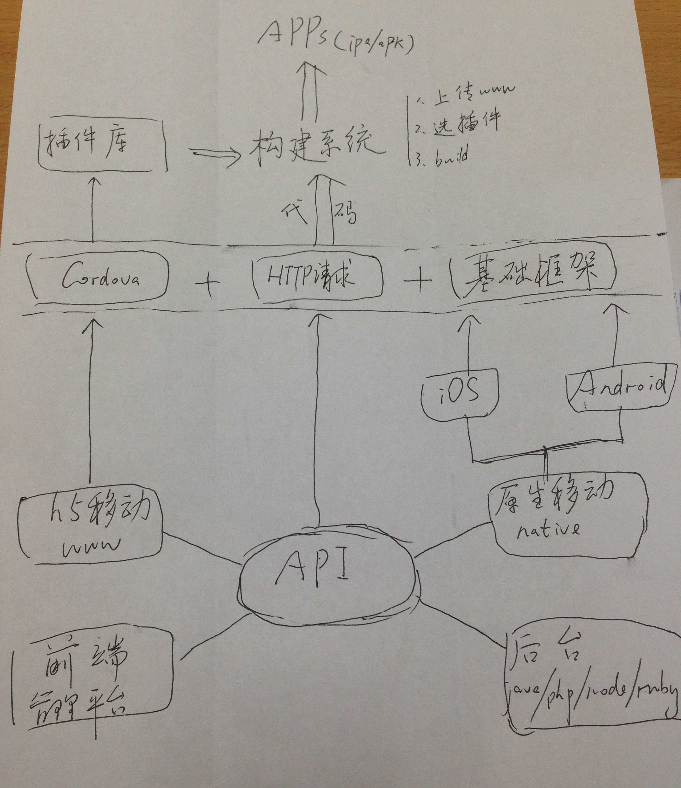
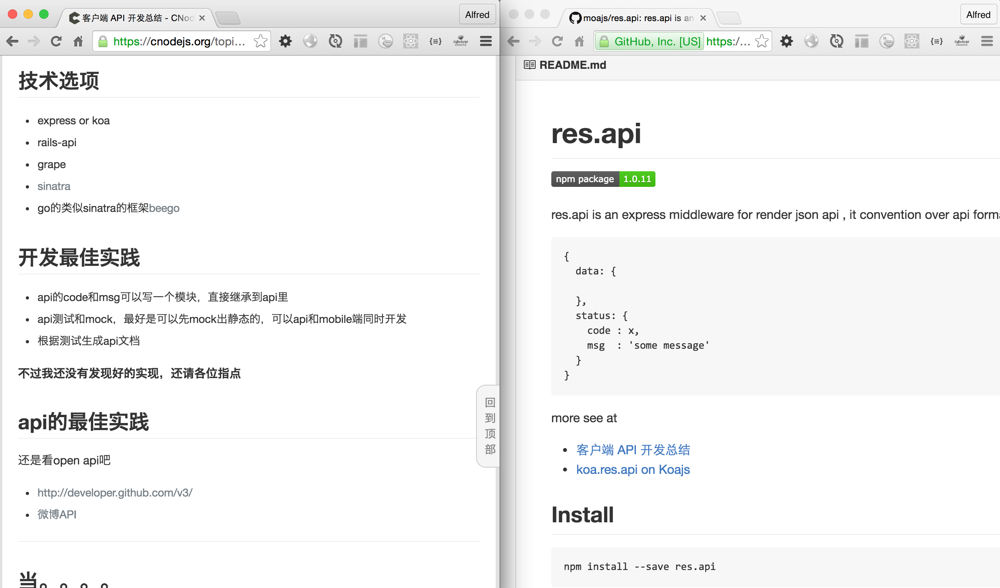
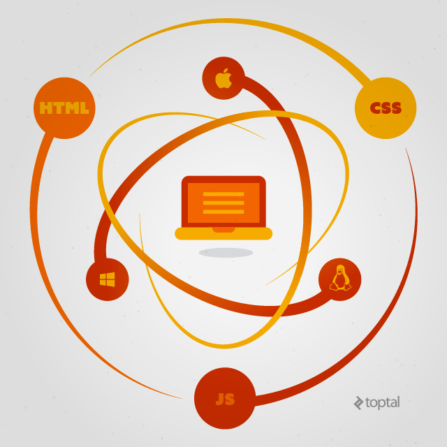

# 全栈工程师之路-Node.js

高可用架构专用

原文[高可用架构]

https://mp.weixin.qq.com/s?__biz=MzAwMDU1MTE1OQ==&mid=405001493&idx=1&sn=f0ecab9b31bad83fb065ac37bb728245&scene=1&srcid=0324iTRH12WbXL5VDxXnEhH8&key=710a5d99946419d938a0ffc16a3c72118eefbe33f3f8312ed218bccbde126b60e818c8eb1068a9b07bdc8116a077b911&ascene=0&uin=NDIzMjM3MDk1&devicetype=iMac+MacBookPro11%2C1+OSX+OSX+10.10.5+build(14F27)&version=11000006&pass_ticket=xdp3crkTJPuOH6ggUMKnwvfDGKEnMUvwC5V%2FdxlW%2FKdNO9R8zI1xsDFSR4ZJECUU

仔细的对比了一遍，感谢tim yang和庆丰校长的整理，非常严谨，比我讲的要好，另外感谢霍老板封我是StuQ明星讲师[呲牙][呲牙]

持续更新版本

- 仓库地址 https://github.com/i5ting/nodejs-fullstack
- 在线阅读 http://i5ting.github.io/nodejs-fullstack/ 
- [keynote版本](https://github.com/i5ting/nodejs-fullstack/raw/master/dist/%E5%85%A8%E6%A0%88%E5%B7%A5%E7%A8%8B%E5%B8%88%E4%B9%8B%E8%B7%AFNode.js.key)
- [pdf版本](https://github.com/i5ting/nodejs-fullstack/raw/master/dist/%E5%85%A8%E6%A0%88%E5%B7%A5%E7%A8%8B%E5%B8%88%E4%B9%8B%E8%B7%AFNode.js.pdf)


已参加分享

- 高可用架构群
- [3月26日北京 NodeParty](https://cnodejs.org/topic/56f8ce05e2d0ba0b32388717)
- [5月7日天津 SegmentFault D-Day](https://segmentfault.com/e/1160000004637487)
- [5月21日北京 Node.js Live](http://live.nodejs.org/zh-CN/events/beijing.html)
- [6月18日北京 野狗Meetup技术沙龙](https://segmentfault.com/e/1160000005694214)


如果想邀请分享，请邮寄给我i5ting@126.com,如果时间ok，我会尽量分享

## 主要内容

1. Why Node.js ？
  - 历史
  - 槽点
  - 架构平衡和选择
  - 企业级
2. 我眼中的Node.js核心
3. 快速开发实践
4. 全栈 or 全烂 ？
  - 工具链
  - 前端开发4阶段
  - Hybrid开发
  - 跨平台
  - 全栈的可能
5. 未来


最近比较火的2016年开发者调查了，Node.js和全栈、以及和js相关的技术都有不错的战绩，这次给大家分享一下《全栈工程师之路-Node.js》，准备的还不够充分，水平也有限，大家见谅啊

http://stackoverflow.com/research/developer-survey-2016


## 讲师介绍

英文版本


Afred Sang（aka i5ting）

Alfred Sang (aka i5ting), CTO of Aircos, top trainer of StuQ, author of the open source project Moa.js, and also an evangelist of Node.js. The uniqueness of his experience makes him a full stack practitioner. He served at Sina, NQ Mobile by playing several major roles, such as Chief Architect, R&D Director. Currently, he is focusing on technical architecture and organization/talent development. A book from him, named as "Smashing Node.js 6: Koa Everywhere", is also on the way.

He will talk about the pros and cons of Node.js, why it is a good choice for startups, and how to make the right architecture for different scenarios. While on the subject, a thorough and in-depth overview of the myth of the full-stack developer will also be covered.


中文版


桑世龙（网名i5ting），空弦科技 CTO，StuQ 明星讲师，开源项目 Moajs 作者，Node.js 技术布道者
曾就职在新浪、网秦，曾做过前端、后端、数据分析、移动端负责人、做过首席架构师、技术总监，全栈技术实践者，目前主要关注技术架构和团队梯队建设方向，正在写一个本新书《更了不起的 Node 4：将下一代 Web 框架 Koa 进行到底》

他将讲述 Node.js 的优劣势、为什么它适合创业公司以及如何在不同的情况下选择正确的架构。与此同时，一个全面深入的关于全栈开发者秘密的总览也会涵盖其中。


我这里面先问一下，大家有多少人了解Node.js？有多少做前端的？做前端又有多少了解Node.js的？看来还不是很多，其实Node.js就是如果做前端不了解Node.js，我觉得在未来就不是一个好的前端了，所以我们这块讲的时候会把相关的内容加进来，第一个讲一下为什么选择Node.js，这个是从我们公司一个初创企业的角度讲的，之后讲一下Node.js核心的东西，然后讲一下实战经验，最后把全栈的展望，一直从前端，后端，移动端，包括我个人的全栈之路，把这整个全栈路径跟大家分享一下。


# Part 1：为什么选用Node.js ？

已经7岁的Node.js，你还熟悉么？

以前？现在？

## 回顾一下2015年Node.js的发展历史

http://i5ting.github.io/history-of-node-js/

### Q1(1季度)

- IO.js 1.0.0 发布
- Joyent 推进建立 Node.js 基金会
  - Joyent, IBM, Microsoft, PayPal, Fidelity, SAP and The Linux Foundation Join Forces to Support Node.js Community With Neutral and Open Governance
- IO.js 和 Node.js 和解提案

### Q2(2季度)

- npm 支持私有模块
- Node 项目领导人 TJ Fontaine 逐步解除核心身份并离开 Joyent 公司
  - A changing of the guard in Nodeland.
- Node.js 和 io.js 在 Node 基金会下合并情况

### Q3(3季度)

- 4.0 版本发布，即新的 1.0 版本

### Q4(4季度)

- Node v4.2.0，首个长期支持版本（LTS）
- Apigee，RisingStack 和 Yahoo 加入 Node.js 基金会
- Node Interactive
  - The first annual Node.js conference by the Node.js Foundation

## 版本帝？

去年

- 从v0.10.35 开始
- 2015-01-14发布了v1.0.0版本（io.js）
- 2.x（io.js）
- 3.x（io.js）
- 2015年09月Node.js基金会已发布Node.js V4.0版 与io.js合并后的第一个版本
- 2015年10月Node.jsv4.2.0将是首个lts长期支持版本
- 年底发布到4.2.4 && 5.4.0
       
       
目前（2016年3月20日）的2个版本

- v4.4.0 LTS（长期支持版本）
- v5.9.0 Stable（稳定版本）


整体来说趋于稳定

- 成立了nodejs基金会，能够让nodejs在未来有更好的开源社区支持
- 发布了LTS版本，意味着api稳定
- 快速发版本，很多人吐槽这个，其实换个角度看，这也是社区活跃的一个体现，但如果大家真的看CHANGELOG，其实都是小改进，而且是边边角角的改进，也就是说nodejs的core（核心）已经非常稳定了，可以大规模使用


## 以前我们总是喜欢拿异步说事儿

Node.js与生俱来的2个特性

- event-driven
- non-blocking I/O

结果，今天。。。各种【异步】。。。烂大街了

异步已经不是明显优势了

## 除了性能，其他都是病？

- 第一、callback hell问题，目前已经很好的解决了，promise/generator/async后面会讲
- 第二、npm已经是开源世界里最大的包管理器了，模块非常丰富（25.6万+）


官方说

```
Node.js' package ecosystem, npm, is the largest ecosystem of open source libraries in the world.
```

以前我们总是喜欢拿异步说事儿，现在我们拿Node.js的强大的生态来炫耀

## 大事儿记

下面介绍点Node.js的大事儿记

### 企业级

- 2014年 nearform [NODE.JS为什么会成为企业中的首选技术](http://www.nearform.com/nodecrunch/node-js-becoming-go-technology-enterprise/)


- 2015年 IBM [收购 StrongLoop，拓展云服务业务](http://www-03.ibm.com/press/us/en/pressrelease/47577.wss)


Node.js基金会的创始成员包括Joyent、IBM、Paypal、微软、Fidelity和Linux基金会



更多参见
https://nodejs.org/en/foundation/members/

对于企业级开发，Node.js是足够的，无论从性能、安全、稳定性等都是非常棒的。

空弦科技做的是基于云仓储的SaaS服务，给中小卖家提供服务，核心系统是进销存+订单池+WMS。目前来看不存在任何问题，稍后会讲我们为啥选择Node.js

### es && babel

- 2015年 Ecma国际大会宣布正式批准ECMA-262第6版，亦即ECMAScript 2015（曾用名：ECMAScript 6、ES6）的语言规范

http://babeljs.io/

babel作为es编译器，已经大量开始使用了，模块做的非常棒，还有人用babel写其他语言编译器

Node.js里在0.12之后才增加es6特性，es7的目前还不支持。

所以在Node.js里使用es里比较高级的特性，是需要babel去编译处理的。

这是node追逐的事实标准

### 微软请求 Node.js 支持 ChakraCore

-  2016年01月22日，[微软请求 Node.js 支持 ChakraCore](https://github.com/nodejs/node/pull/4765)

未来Node.js不只是基于chrome v8引擎，它还可以支持更多其他js引擎，对生态、效率提升等非常有好处

蔡伟小兄弟的[查克拉benchmark的对比](https://github.com/DavidCai1993/ES6-benchmark)

```
基本结论是 V8 ES5 >> 查克拉 ES6 > 查克拉 ES5 > V8 ES6
```

## 为什么我们选择Node.js ？

先看一下我们的瓶颈在哪里 ？

- 1）人（天津不好招人）

Node.js招不到，好多都是从java转的，前端也不好找，好多也是从java转的，我们相当于从0开始组建团队

- 2）开发速度

创业公司，5分钟要造火箭。。。大家都懂

所以让开发快速进入状态，提高开发速度，对我们来说至关重要

- 3）稳定

在没有专业运维人员的情况下，如何保证系统可用、稳定


于是就引出了我认为的Node.js的好处

- 1）即同样不优化，性能比大部分语言好(天生被黑的优越感，没办法)
- 2）即使优化，也比其他语言简单，比如java
- 3）有足够多的选择和架构的平衡
- 4）如实在不够，java补


## 黑一下go语言吧

go的缺点是很难够(go)着

- 没有好的包管理，目前生态还不是特别好，选择的可能不多
- 没有好的调试工具，tdd/bdd新手难掌握(vscode-go还凑合)
- 语法不习惯，强c背景的人不多

总结：适合高端人群，但对团队开发是有门槛的，不适用国内大部分大团队，当然如果你的团队足够牛逼，选go是非常好的选择。

羊和骆驼的故事告诉我们：够得着你牛逼，够不着，累死你也够不着

## 选择

Node.js给了我们足够的选择空间

### 1）可难可易

- 可以采用面向过程
- 可以面向对象
- 可以函数式

甚至可以用各种编译器coffee、typescript、babel（es）等

对于从0开始的团队来讲，可以先面向过程、然后随着团队的成熟度，一点一点增加难度

### 2）提供好的基础和包管理工具

- 测试相关 tdd/bdd/测试覆盖率
- 规范化 standard、各种lint、hint
- 构建相关 gulp、grunt、webpack，大量插件
- 生成器 yo等
- 包管理工具npm足够简单易用

以上这些都做大型软件的基础，Node.js在这方面做得非常好

### 3）特定场景的快速

很多人把mean组合（比如mean.io）起来，这样做的好处是如果熟悉，开发速度确实会非常快，但确定是难度太大，很少有人能搞的定

metetor模糊了服务端和客户端，是同构的典型应用，对于实时场景是非常高效的。

这种东西都算特定场景的快速，一般不敢轻易上，调优难度非常大，如果有人能cover的住，在初期是非常高效的。

### 4）总结

- 可以简单，可以难
- 可以快、也可以慢
- 可以开发大型软件

还有一个问题就是如果以上不满足咋办？这时就需要架构平衡了

## 架构平衡

先说技术选型的3个思考点

- 在语言层面可以做，那语言层面做
- 如果语言层面搞不定，那就架构层面做
- 如果架构层面也搞不定，这东西就不能用了



各自做各自合适的事儿就好，下面分别举例看看

我们很坦然的面对Node.js的优点和缺点

- 1）语言层面能解决的
  - 已有大量npm上的模块(目前在25.6万个以上) 
  - 自己造轮子(站在海量包上+简单语法+npm=快速)
  - 使用Node.js里的[nan](https://github.com/nodejs/nan)自己包装c/c++轮子

绝大部分需求都可以满足了  

- 2）架构层面能解决的
  - 业务边界、模块拆分、面向服务
  - mq、rpc、cache
  - 运维、监控、自动化

稍微解释一下

- 首先，架构和是不是Node.js写的没关系，是独立的
- 其次，架构师常用的东东有足够的Node.js模块支持，比如mq，像rabbitmq有比较好的node模块支持，像rpc里thrift、grpc、tchannel支持的都不错，我们使用的senecajs，比如redis，我们使用的ioredis，后面做ha都是一样的。
- 合适的场景用合适的东西

有很多东西是Node.js不擅长，又不在架构范畴里的，咋办？

3）如实在不够，java补（严格点，应该叫其他语言补）
  - 比如复杂excel生成
  - 比如apns推送（go做其实也很好，不过除了我，没人能维护。。。）

但凡是java或其他语言里比较成熟的库，可以作为独立服务使用的，都可以做Node.js的支持。避免过多的时间用在早轮子上，影响开发进度

## 效率问题？

执行效率：

- 同样不优化，性能比大部分语言好

开发效率：

- Node.js本身比较简单，开发效率还是比较高的
- 完善的生态，比如测试、工具、npm大量模块

缺少rails一样的大杀器
  
  - scaffold脚手架
  - orm太弱

Node.js的web开发框架express、koa等，简单，小巧，精致，缺点是集成度不够，目前已有的mean或yo或sails等总有某种方面的不满意

所以我们需要做的

- 固化项目结构
- 限定orm
- 自定义脚手架

偏偏Node.js提供了2点，可以让你30分钟写一个脚手架

- cli命令模块，编写非常容易
- 基于js的模板引擎（知名的30+）


## 我们用Node.js做什么？

- api服务
- 前端（moa-frontend）
- SDK（OAuth Provider）
- 辅助开发cli工具

## 目前进度

- 使用0.10.38，开发moajs框架
  - express/mongodb
  - pm2部署
  - 阿里云的slb负载
  - alinode监控
- 前后端分离
  - moa-api
  - moa-frontend
  - moa-h5(未能用)
- 上redis缓存
- 上rabbitmq
- 上senaca作为rpc
- 上kong作为api gateway（todo）
- 上consul做服务发现和配置（todo）
- 上elk作为日志分析处理（todo）
- 使用docker compose作为本地开发环境（todo）
- 线上docker（todo）

技术栈更新

- nodejs 4.x（预计今年6月份）
- koa（generator/co）
- es6/es7(babel)

4.x在内存和性能上都有非常大的提升，新的语言特性上，异步流程和语法上都需要学习，故不急于升级，待人才梯队完善

目前的做法是小步快走

- 一次只上一样新技术
- 形成梯队，即可准备上新东西
- 善用npm，实现3化
  - 模块化
  - 最小化
  - 服务化
  
              
# Part 2：我眼中的Node.js核心


- 1）小而美的哲学
- 2）从LAMP到MEAN
- 3）异步流程控制
- 4）Node.js Web开发
- 5）Node.js 模块开发

时间原因，接下来稍微介绍一下MEAN

## 小而美的哲学

"Small is beautiful"是Unix哲学9条里的第一条，但对Node.js来说，它实在是再合适不过了

http://blog.izs.me/post/48281998870/unix-philosophy-and-nodejs

<!--  -->

- Write modules that do one thing well. Write a new module rather than complicate an old one.
- Write modules that encourage composition rather than extension.
- Write modules that handle data Streams, because that is the universal interface.
- Write modules that are agnostic about the source of their input or the destination of their output.
- Write modules that solve a problem you know, so you can learn about the ones you don’t.
- Write modules that are small. Iterate quickly. Refactor ruthlessly. Rewrite bravely.
- Write modules quickly, to meet your needs, with just a few tests for compliance. Avoid extensive specifications. Add a test for each bug you fix.
- Write modules for publication, even if you only use them privately. You will appreciate documentation in the future.

## 从LAMP到MEAN

MEAN是目前最潮的全栈javascript架构

MEAN是一个Javascript平台的现代Web开发框架总称，它是MongoDB + Express +AngularJS + NodeJS 四个框架的第一个字母组合。它与传统LAMP一样是一种全套开发工具的简称。


从我的角度看

- mysql用mongodb替换，nosql里最像rdbms的，从开发和性能都是有优势的（老毕已经讲过了）
- angular的出现是一个时代，ioc，双向绑定，指令等都曾让无数热血沸腾
- nodejs提供了完全的生态和工具链，你要的它基本都有，感谢npm，早些年nodejs的性能甩php几条街的
- express作为nodejs示范项目，它非常精简，是比较合适的web框架


我为什么选择MEAN架构？

- 成熟、稳定，简单，有问题我们能cover住，所以我们选了nodejs
- 把握趋势，以后nodejs的前景非常看好，尤其先后端统一，全栈方向
- 在架构上可以屏蔽可能风险，不孤注一掷，也不会一叶障目，合理的使用其他语言，只要每个功能都以服务出现，至于它是什么语言写的，并不重要
- 招人成本的性价比相对较高，技术栈新，容易吸引人才

最重要的一件事儿，是当有问题的时候，有人能cover住，在创业初期这是最最重要的事儿。

我的一篇爆款文章《Node.js最新Web技术栈（2015年5月）》https://cnodejs.org/topic/55651bf07d4c64752effb4b1
讲的就是我们用的技术栈


## 异步流程控制

js流程控制的演进过程，分以下5部分

- 1) 回调函数Callbacks
- 2) 异步JavaScript
- 3) Promise/a+规范
- 4) 生成器Generators/ yield(es6)
- 5) Async/ await(es7)


- 目前所有版本都支持Promise/a+规范
- 目前Node.js 4.0 + 支持Generators/ yield
- 目前不支持ES7里的Async/await，但可以通过babel实现

整体来说，对异步流程控制解决的还是比较好的。

详见[Node.js最新技术栈之Promise篇](https://cnodejs.org/topic/560dbc826a1ed28204a1e7de)

## Node.js Web开发

- Node.js Web开发
  - express、koa
  - restify、hapi
  - 其他框架sails、meteor

各种类型web开发都支持的，一般我们采用非restful的使用express、koa更简单

如果是纯restful，可以采用restify、hapi

另外还有快速模拟api的[json-server](https://github.com/typicode/json-server)，对rest支持超方便

## Node.js 模块开发

- Node.js模块开发
  - 普通模块
  - cli
  - 脚手架scaffold
  - c/c++ addons

普通模块和cli模块只是差package.json里的

```
  "preferGlobal": "true",
  "bin": {
    "kp": "kp.js"
  },
```

脚手架scaffold = cli + 模板生成，在Node.js里这2点都非常容易

在Node.js里写c/c++扩展，有nan抽象层，其他就看大家的c/c++水平了

## 其他

### 如何看到koa && koa2


http://17koa.com/node4koa/#/

### 数据库

见mongoose.md

### 如何做benchmark

https://github.com/17koa/koa-benchmark

### 开源项目里怎么样写测试、CI和代码测试覆盖率

https://cnodejs.org/topic/558df089ebf9c92d17e73358

### 真实环境部署nodejs程序

见deploy.md

# Part 3：快速开发实践

## 1、业务边界优化

创业公司有很多可变性，要做的系统也无数，如何保证业务系统的边界是非常难的，我们其实走了很多弯路，图-稍后补


## 2、静态api理论


当需求和ue定下来之后，就开始编写静态api，这样app、h5、前端就可以使用静态api完成功能，而后端也可以以静态api为标准来实现，整体效率还是比较高的。


另外还有基于api生成http请求的思考（未完成）



## 3、api约定




api的最佳实践


- http://developer.github.com/v3/ （严格的restful）
- 微博API (可读性强，相对比较传统)

我们采用的微博API类似的，约定结构也是类似的

res.api is an express middleware for render json api , it convention over api format like this :

```
{
  data: {

  },
  status: {
    code : x,
    msg  : 'some message'
  }
}
```

详见[客户端 API 开发总结](https://cnodejs.org/topic/552b3b9382388cec50cf6d95)

## 4、约定结构


和java开发里的目录结构类似，该分层的分层，适当的按照express/koa增加中间件、路由等目录，便于开发

## 5、使用npm模块化

- 使用npmjs的private私有模块（目前做法）
- 使用npm的本地模块开发方法（测试和部署都非常快）
- 搭建npm私服（todo）

```
hz-api-cloud-admin
hz-api-cloud-order
hz-api-cloud-stock
hz-api-private
hz-api-private-admin
hz-dao-cloud
hz-dao-private
hz-dao-usercenter
hz-doc-api
hz-frontend
hz-mq 
hz-sms
hz-usercenter
xbm-sdk
hz-api-admin
hz-api-crm
hz-api-order
hz-api-statistics
hz-api-stock
hz-config
hz-dao
hz-doc
```


## 6、编写生成器

在web开发里，写了moajs生成器，类似于rails

```
moag order name:string password:string
```

其他开发，如iOS开发里模型校验非常烦,于是写了一个json2objc命令行工具，读取json，生成oc代码，可以节省不少时间

## 7、Moajs框架和前后端分离

- 前端：[moa-frontend](https://github.com/moajs/moa-frontend)
  - public下面的采用nginx做反向代理
  - 其他的采用express+jade精简代码（ajax与后端交互）
- 后端：[moa-api](https://github.com/moajs/moa-api)

### 1）moa生成器

即上面讲的生成器scaffold

### 2）moa-frontend

技术栈

- express
- jade
- bootstrap、bootstrap-table
- jquery
- gulp
- nginx

### 3）moa-api

技术栈

- [base2(mirco kernel)](https://github.com/base-n/base2-core)
- [mongoose](https://github.com/Automattic/mongoose)
- [bluebird](https://github.com/petkaantonov/bluebird)
- [res.api](https://github.com/moajs/res.api)

Features

- 自动加载路由
- 支持mongodb配置
- 集成mongoosedao，快速写crud等dao接口
- 自带用户管理
- 使用jsonwebtoken做用户鉴权
- 支持migrate测试
- 支持mocha测试
- 默认集成res.api，便于写接口
- 集成supervisor，代码变动，自动重载
- gulp自动监控文件变动，跑测试
- gulp routes生成路由说明
- 使用log4js记录日志

### 4）总结

从开发效果上看，还是非常快的，非常稳定的

更多参见我写的[《Moajs框架演进之路》](https://cnodejs.org/topic/567e2388aacb6923221de469)


## 其他

- 《从0开始写Node.js框架》

# Part 4：全栈 or 全烂 ？

## Node.js相关工具

- grunt/gulp/fis/webpack
- bower/spm/npm
- tdd/bdd cucumber/mocha
- standard
- babel/typescript/coffee

## 前端开发4阶段

- html/css/js（基础）
- jQuery、jQuery-ui，Extjs（曾经流行）
- Backbone（mvc），Angularjs、Vuejs（当前流行）
- React组件化（未来趋势）、Vuejs

Vuejs综合Angular和React的优点，应该是下一个流行趋势

## Hybrid开发

Hybrid混搭开发是指使用html5技术开发的跨浏览器应用，并最终可以将html5.js.css等打包成apk和ipa包的开发方式。它也可以上传到应用商店，提供给移动设备进行安装。它最大的好处是通过h5开发一次，就可以在多个平台上安装。

未来的2点

- js一统天下（nodejs做后端，传统web和h5使用javasctipt，更智能的工具如gulp，更简单的写法如coffeescript等）
- h5大行其道（网速变快，硬件内存增长）

## 跨平台

### 1）c/s架构到b/s架构

这个大部分都清楚，不多说

### 2）移动端：加壳


在浏览器上做文章，把页面生成各个移动端的app文件

### 3）PC端：继续加壳



一样是延续浏览器做文章，不过这次把页面生成各个PC平台的可执行文件

- node-webkit is renamed [NW.js](https://github.com/nwjs/nw.js)
- [Electron](https://github.com/atom/electron) - Build cross platform desktop apps with web technologies

目前比较火的编辑器[atom](https://github.com/atom/atom)和[vscode](https://github.com/Microsoft/vscode)都是基于Electron打包的。

### 4） 组件化：统一用法


React的出现影响最大的是jsx的出现，解决了长久以来组件化的问题，

- 我们反复的折腾js，依然无法搞定
- 我们尝试OO，比如extjs
- 我们最终还是找个中间格式jsx

单纯的React只是view层面的，还不足以应用，于是又有Redux

核心概念：Actions、Reducers 和 Store，简单点说就是状态控制

然后再结合打包加壳，变成app或可执行文件

- iOS、Android上用Cordova
- PC上使用Electron

总结

- 组件定义好（React）
- 控制好组件之间的状态切换（Redux）
- 打包或加壳（Cordova or Electron）

这部分其实组件化了前端，那么能否用这样的思想来组件化移动端呢？

再看[react-native](https://github.com/facebook/react-native)

A framework for building native apps with React. http://facebook.github.io/react-native/

简单点说，就是用React的语法来组件化iOS或Android SDK。

它们都在告诉我们，你们以后就玩这些组件就好了，你不需要知道复杂的SDK是什么

### 5）当下流行玩法


[Medis](https://github.com/luin/medis) is a beautiful, easy-to-use Redis management application built on the modern web with Electron, React, and Redux. It's powered by many awesome Node.js modules, especially ioredis and ssh2.


技术点

- 使用Node.js模块
- 使用Webpack构建
- 使用React（视图） + Redux（控制逻辑）
- 使用Electron加壳打包

亲，你看到未来了么？


### 6）总结

讲了node工具，前端4阶段，hybrid，各种跨平台，目前就是为了介绍Node全栈的各种可能，下面讲一下如何能做到Node全栈？

## 如何全栈？

全栈核心

- 后端不会的ui（界面相关）
- 前端不会的db（业务相关）

只要打通这2个要点，其他就比较容易了

### 我的全栈之路

```
没有目标就向钱看，自然会找到目标
```

- 从java开始，蹭课，背着机箱到深圳，3个月胖20斤
- 坚持翻译英文文档，看thinkinjava
- 毕业后开始bi，整理bi文档
- 学长明林清，传授jQuery，愿意学，别人就更愿意分析
- 接手《内蒙广电数据分析与科学决策系统》，打通前、后端
- 广东联通，自己造轮子，写jQuery插件，DRY
- 做云计算，学习AIX，写有《凌云志》
- 分手、离职，去做iOS，从cordova开始搞h5，研究各种移动端框架，自己写框架，转原生
- 面试也是学习的利器，轻松进新浪

```
既然无法逃避，就热爱它，最后变成兴趣
```

- 总结了大量iOS经验，想写书，结果写了一堆写书的工具
- 去网秦做技术总监，做首席，管架构，带人，写开源项目
- 创业，当cto，结婚，做公众号运营，写书，只在StuQ讲点课

```
人生不只有代码，但它能让我快乐，终生受益
```

也曾懵懂，也曾迷茫，但我这人比较傻，一直信奉：“一次只做1件事儿，尽力做到极致”，短时间看这是比较傻的，但一旦你坚持下去，你就会发现技术其实是门手艺，厚积薄发。

我没办法说自己最擅长什么，但在什么场景下用什么技术是我擅长的。或者说，应变是我最大的本事。很多框架，新技术我都没见过，用过，但花一点点过一下，就能拿已有的知识快速的理解它，这其实是长期学习的好处。

现在越来越忙，写代码的时间越来越少，技术又越发展越快，我能做好的就是每日精进，仗着这点已有的知识储备跟年轻人比赛。我不觉得累，相反我很享受这种感觉，没有被时代淘汰，是一件多么幸福的事儿。

### 1）从后端转

做后端的人

- 对数据库是比较熟悉，无论mongodb，还是mysql、postgres
- 对前端理解比较弱，会基本的html，css，模板引擎等比较熟悉

```
4阶段循序渐进，build与工具齐飞
```

前端开发4阶段，我的感觉是按照顺序，循序渐进

- html/css/js（基础）
- jQuery、jQuery-ui，Extjs（曾经流行）
- Backbone，Angularjs（当前流行）、Vuejs
- React（未来趋势）、Vuejs

### 2）从前端转


从前端往后端转，api接口非常容易学会，像express、koa这类框架大部分人一周就能学会，最难的是对db、er模型的理解，说直白点，还是业务需求落地的理解

我们来想想一般的前端有什么技能？

- html
- css（兼容浏览器）
- js会点（可能更多的是会点jquery）
- ps切图
- firebug和chrome debuger会的人都不太多
- 用过几个框架，大部分人是仅仅会用
- 英语一般
- svn/git会一点

那么他们如果想在前端领域做的更深有哪些难点呢？

- 基础：oo，dp，命令，shell，构建等
- 编程思想上的理解（mvc、ioc，规约等）
- 区分概念
- 外围验收，如h5和hybird等
- 追赶趋势，如何学习新东西

以上皆是痛点。


所以比较好的办法

- 玩转npm、gulp这样的前端工具类（此时还是前端）
- 使用node做前后端分离（此时还是前端）
  - express、koa这类框架
  - jade、ejs等模板引擎
  - nginx
- 玩转【后端】异步流程处理（promise/es6的(generator|yield)/es7(async|await)）
- 玩转【后端】mongodb、mysql对应的node模块

从我们的经验看，这样是比较靠谱的。

https://github.com/moajs/moa-frontend

就是最简单前后端分离，里面没有任何和db相关，

技术栈

- express
- jade
- bootstrap，bootstrap-table
- jquery
- gulp
- nginx

一般的前端都非常容易学会，基本2周就已经非常熟练了，我的计划是半年后，让他们接触【异步流程处理】和【数据库】相关内容，学习后端代码，就可以全栈了

<!--  -->

### 3）从移动端转

移动端分

- native原生开发
- hybrid混搭式开发

原生开发就是iOS用oc/swift,Android用java或scala等，就算偶尔嵌入webview，能玩js的机会也非常好少

所以移动端转全栈的方法，最好是从cordova（以前叫phonegap）开始做hybrid开发。

- 只要关注www目录里的h5即可，比较简单
- 如果h5不足以完成的情况下，可以编写cordova插件，即通过插件让js调用原生sdk里功能
- cordova的cli可以通过npm安装，学习npm的好方法
- 学习gulp构建工具

只要入了h5的坑，其实就非常好办了。

- 然后h5、zeptojs、iscroll、fastclick等
- 然后微信常用的，如weui、vux（vue+weui）、jmui（react+weui）
- 然后可以玩点框架，比如jquery mobile，sencha touch
- 然后可以玩点高级货，ionicframework（基于angularjs、cordova）
- 然后前端4阶段，依次打怪升级
- 然后node

这个基本上是我走的路，从2010年写iOS、做phonegap（当时是0.9.3）、一路走到现在的总结吧

# Part 5：未来

可能是一场春梦，也可能一个变革机遇，我们更相信它是变革机遇，拭目以待吧

谢谢大家


- [前端资源教程](https://cnodejs.org/topic/56ef3edd532839c33a99d00e#56f146920a5a2cfb3ad14928)
- [JavaScript 资源大全中文版](https://cnodejs.org/topic/56e8c95dcf7763a6045c4ae4)


# Q & A

## 问题一：在全栈的语言选择上，除了node.js，是否还考虑过其他语言？

有的，未来swift和lua是有可能的。swift的语法和性能上有很大优势，lua在openresty的推动下也有机会，不过没有swift大

像WebAssembly之类的就不太看好了


## 问题二：请教桑老师：刚才你说的并发开发流程中静态api指的是api文档？
如果是的话谁负责编写？你们目前已经是一个人分模块从前端写到后端了吗？

目前没做到文档即静态api，所以目前是直接提供json和部分[json-server](https://github.com/typicode/json-server)

负责是后端开发的leader在写，他的进度会比正常开发要早一周左右

目前不是一个人写所有的前后端，团队成立不久，天津Node.js会的不多，所以还是前后端分离。但是通过moa-frontend可以让前端了解express等后端知识，适当的时候会给予机会，前端转后端


## 问题三：第一贵司在开发协作中提到了静态api，请问是不是有什么比较好的工具可以推荐？

nodejs里[json-server](https://github.com/typicode/json-server) 比较好

我其实很想围绕静态api，写各种请求的生成器，只要api出来，文档和各平台的http请求代码就生成出来，同时可以对正式api进行压测，可惜目前还没精力写

## 问题四：做hybrid app在移动端会遇到性能问题吧。。有没有什么优化经验可以分享？

- 足够轻量级，少选大框架，做好前端该有的优化
- 注意touch和click的区别，比如fastclick或zeptojs的tap手势
- Chrome profile（css3动画）
- 使用weinre真机测试


[我的h5实践](http://mp.weixin.qq.com/s?__biz=MzAxMTU0NTc4Nw==&mid=222892082&idx=1&sn=ba1cdb42b43fbec08e4328c5080774e5#rd)


## 问题五：如果都全栈了，当前你们团队是如何分工的？

我们团队还是倾向于分工专业化，各个服务粒度非常小，便于轮岗、还有就是可以为以后像google那样代码开放做准备

但是有很多情况下，是需要有机动的突击队的（尤其是创业时期），这样可以随便组合，另外就是全栈为remote提供了更多便利性。

## 问题六：h5在手机上用iscroll坑比较多啊 尤其三星打开硬件加速的时候render页面，桑老师怎么看？

可以尝试一下淘宝系的h5虚拟化，鬼道曾经在as大会上讲过的，我们目前还没能力做这么深层次的优化


## 问题七：Node.js做业务金额计算的金额性能和精度够吗

1）你问的不是Node.js，而是Node.js要操作的数据库。
2）耗性能的计算可以在架构上平衡的
- 如果可以延时，mq就可以了
- 如果是非延时情况，可以采用其他语言编写对应服务，没必要非要一定要Node.js
3）我们目前的场景，还没有在计算遇到瓶颈


## 问题八：关于API返回格式那里，对于status为什么不打平了把code和message放出来？这么设定有什么好处么？


语义上更加清晰

整个返回的json就只有data和status，如果status.code!=0,我取msg就好了，如果等于0，处理data数据

这种设计不见得多好，不过结构清晰，对于开发者来说，是比较容易接受的


# 写给大家：吹牛到寄语

- 时间管理：闲时要有吃紧的心思，忙里要有偷闲的乐趣
- 10年我没有近视，或者说颈椎病
- 吃了11年素食，坚持是自信的源动力
- 一次只做1件事儿，简单一点
- 人老心不老，每日精进，有一双发现知识的小眼睛
- 人生不只有代码，但它能让我快乐
- 应变是我的毕生追求，心里要能装着无数状态
- 少抱怨，多思考，未来更美好：tomorrow is another day

最后祝福大家有一个好身体，做自己喜欢做的事儿，最好都能全栈，加油

全文完

欢迎关注我的公众号【node全栈】


