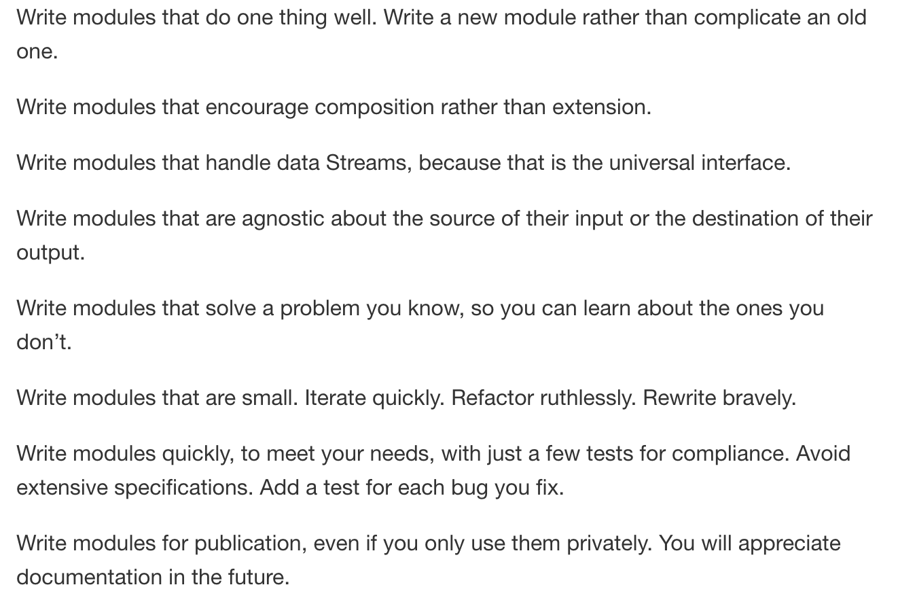

# Node && js = 全栈

高可用架构专用

## 主要内容

1. Why Node.js ？
1. 我眼中的Node.js核心
1. 快速开发实践
1. 全栈 or 全烂 ？
1. 未来

# Part 1：Why Node.js ？

已经7岁的Node.js，你还熟悉么？

以前？现在？

## 以前我们总是喜欢拿异步说事儿

- event-driven
- non-blocking I/O

结果，今天。。。各种【异步模型】。。。烂大街了


## 今天，我们拿什么吹牛呢？

```
Node.js' package ecosystem, npm, is the largest ecosystem 
of open source libraries in the world.
```

## 为什么我们选择Node.js ？

即使不优化，性能比其他语言好

即使优化，也比其他语言简单

如不够，java补

## 平衡

### 执行效率、开发效率与进度

- 执行效率：即使不优化，性能比其他语言好

开发效率：

- Node.js本身比较简单，开发效率还是比较高的
- 完善的生态，比如测试、工具、npm大量模块

缺少rails一样的大杀器
  
  - scaffold脚手架
  - orm太弱

Node.js的web开发框架express、koa等，简单，小巧，精致，缺点是集成度不够，目前已有的mean或yo或sails等总有某种方面的不满意

所以我们需要做的

- 固化项目结构
- 限定orm
- 自定义脚手架

偏偏Node.js提供了2点，可以让你30分钟写一个脚手架

- cli命令模块，编写非常容易
- 基于js的模板引擎（知名的30+）

### 架构平衡


## 目前情况

- 使用0.10.38，开发moajs框架
  - express/mongodb
  - pm2部署
  - 阿里云的slb负载
  - alinode监控
- 前后端分离
  - moa-api
  - moa-frontend
  - moa-h5(未能用)
- 上redis缓存
- 上rabbitmq
- 上senaca作为rpc
- 上kong作为api gateway（todo）
- 上elk作为日志分析处理（todo）
- 使用docker compose作为本地开发环境（todo）
- 线上docker（todo）


## 我们的瓶颈在哪里 ？

- 人（天津招不到人）
- 开发速度（创业公司，跑。。。）
- 传承（以后也要）
              

## 回顾一下历史


# Part 2：我眼中的Node.js核心

MEAN

- 异步流程控制
- cli（scaffold）
- web framework

## 小而美的哲学

"Small is beautiful"是Unix哲学9条里的第一条，但对Node.js来说，它实在是再合适不过了

http://blog.izs.me/post/48281998870/unix-philosophy-and-nodejs

<!--  -->

- Write modules that do one thing well. Write a new module rather than complicate an old one.
- Write modules that encourage composition rather than extension.
- Write modules that handle data Streams, because that is the universal interface.
- Write modules that are agnostic about the source of their input or the destination of their output.
- Write modules that solve a problem you know, so you can learn about the ones you don’t.
- Write modules that are small. Iterate quickly. Refactor ruthlessly. Rewrite bravely.
- Write modules quickly, to meet your needs, with just a few tests for compliance. Avoid extensive specifications. Add a test for each bug you fix.
- Write modules for publication, even if you only use them privately. You will appreciate documentation in the future.

## 取巧：之从LAMP到MEAN

(Mongdb,express,angular,node)架构


## 异步流程控制


- 异步流程控制
  - promise
  - generator+yield
  - co
  - async+await）
  - bluebird

## Node.js Web开发
- Node.js Web开发
  - express
  - koa
  - restify
  - 其他框架sails、meteor

## Node.js 模块开发

- Node.js模块开发
  - 普通模块
  - cli
  - 脚手架scaffold
  - c/c++ addons


# Part 3：快速开发实践


- Node.js实践
  - 前后端分离
  - api
  - mq/rpc/senaca
  - 微服务

# Part 4：全栈 or 全烂 ？

## Node.js工具

- grunt/gulp/fis/webpack
- bower/spm/npm

## 前端开发4阶段

- html/css/js（基础）
- jQuery、jQuery-ui，Extjs（曾经流行）
- Backbone，Angularjs、Vuejs（当前流行）
- React（未来趋势）、Vuejs

Vuejs综合Angular和React的优点，应该是下一个流行趋势

## Hybrid开发

- 移动端概述
- cordova(老的phonegap)
  - 插件
- ionicframework
- h5实践

## 跨平台

懒和折腾的快乐里，安放着程序员的青春

### c/s架构到b/s架构

这个大部分都清楚，不多说

### 移动端：加壳


在浏览器上做文章，把页面生成各个移动端的app文件

### PC端：继续加壳


一样是延续浏览器做文章，不过这次把页面生成各个PC平台的可执行文件

- node-webkit is renamed [NW.js](https://github.com/nwjs/nw.js)
- [Electron](https://github.com/atom/electron) - Build cross platform desktop apps with web technologies

目前比较火的编辑器[atom](https://github.com/atom/atom)和[vscode](https://github.com/Microsoft/vscode)都是基于Electron打包的。

### 组件化：统一用法


React的出现影响最大的是jsx的出现，解决了长久以来组件化的问题，

- 我们反复的折腾js，依然无法搞定
- 我们尝试OO，比如extjs
- 我们最终还是找个中间格式jsx

单纯的React只是view层面的，还不足以应用，于是又有Redux

核心概念：Actions、Reducers 和 Store，简单点说就是状态控制

然后再结合打包加壳，变成app或可执行文件

- iOS、Android上用Cordova
- PC上使用Electron

总结

- 组件定义好（React）
- 控制好组件之间的状态切换（Redux）
- 打包或加壳（Cordova or Electron）

这部分其实组件化了前端，那么能否用这样的思想来组件化移动端呢？

再看[react-native](https://github.com/facebook/react-native)

A framework for building native apps with React. http://facebook.github.io/react-native/

简单点说，就是用React的语法来组件化iOS或Android SDK。

它们都在告诉我们，你们以后就玩这些组件就好了，你不需要知道复杂的SDK是什么

### 当下流行玩法


[Medis](https://github.com/luin/medis) is a beautiful, easy-to-use Redis management application built on the modern web with Electron, React, and Redux. It's powered by many awesome Node.js modules, especially ioredis and ssh2.

技术点

- 使用Node.js模块
- 使用Webpack构建
- 使用React（视图） + Redux（控制逻辑）
- 使用Electron加壳打包

亲，你看到未来了么？

# Part 5：未来

可能是一场春梦，也可能一个变革机遇，拭目以待吧


## 模块化


## 语言

- es6、es7（babel编译）
- typescript（微软）
- coffeescript（式微）


## 工具

