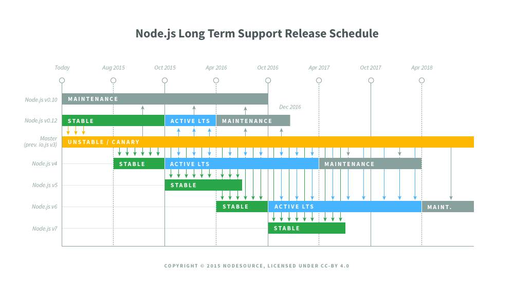
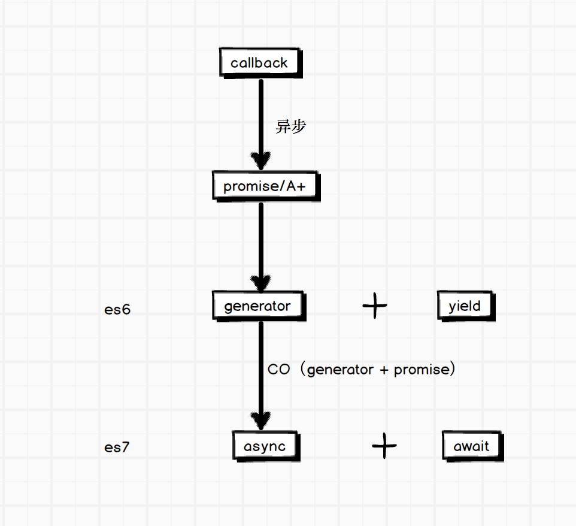
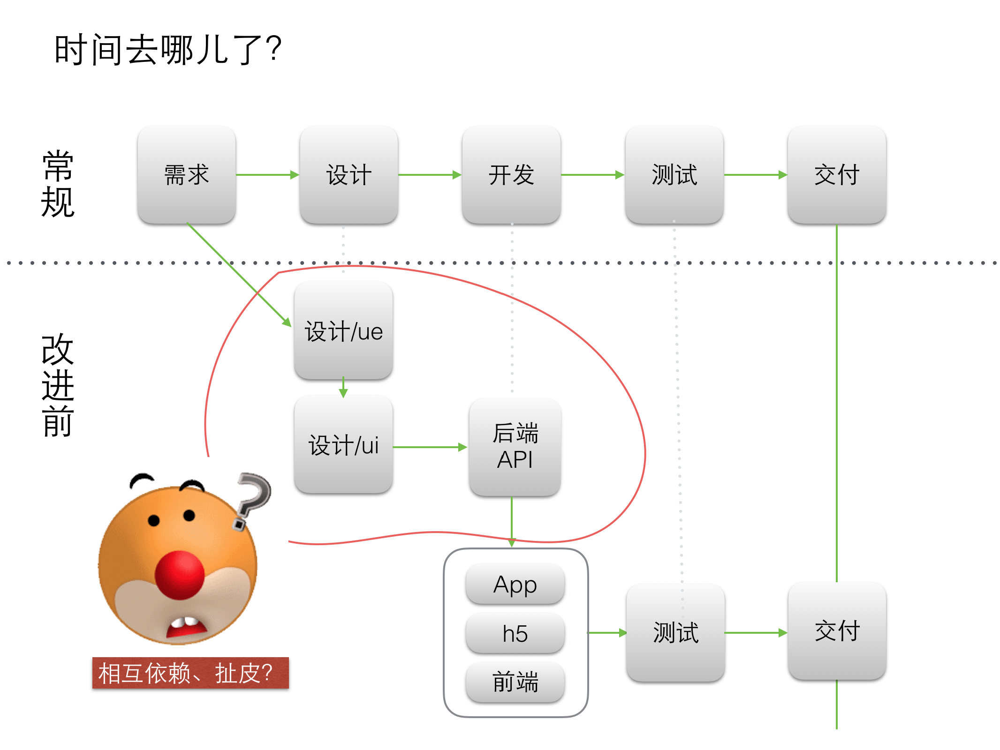
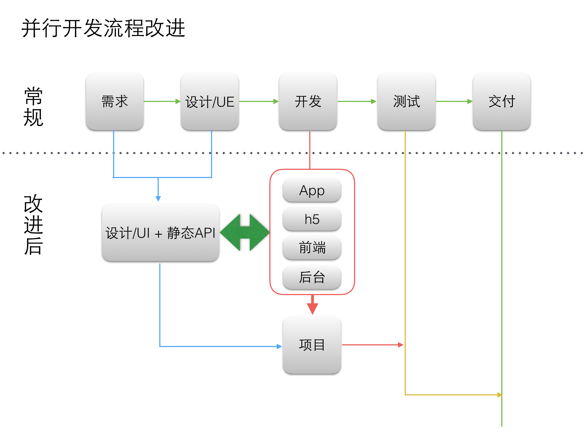
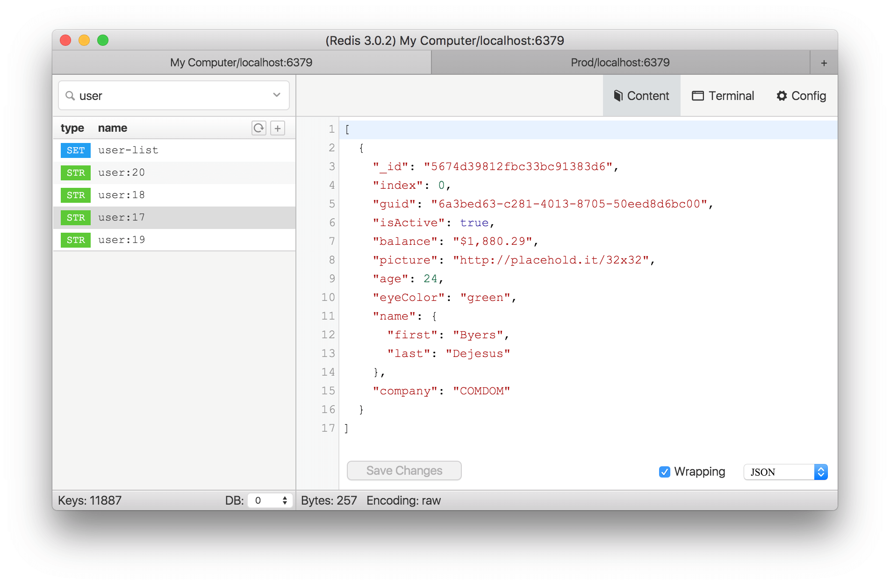
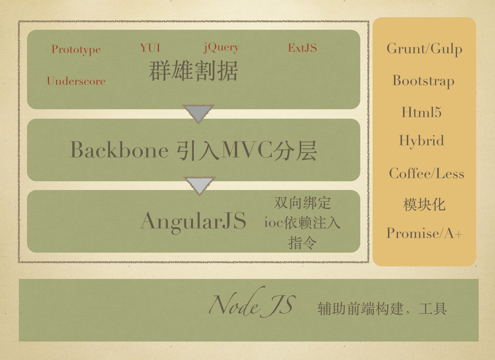

# Node && js 全栈

高可用架构专用


## 主要内容

1. Why Node.js ？
  - 历史
  - 槽点
  - 架构平衡和选择
  - 企业级
2. 我眼中的Node.js核心
3. 快速开发实践
4. 全栈 or 全烂 ？
  - 工具链
  - 前端开发4阶段
  - Hybrid开发
  - 跨平台
  - 全栈的可能
5. 未来

还在调整

## 讲师介绍

桑世龙，目前在天津创业，空弦科技 CTO，开源项目Moajs作者，公司目前使用技术主要是Node.js，
技术栈算所谓的MEAN（mongodb  + express + angular + node）；
曾在新浪，网秦等工作过；
算全栈程序员吧，带过前端、后端、数据分析、移动端负责人、做过首席架构师、技术总监，目前主要从事技术架构 + 招人工作


# Part 1：Why Node.js ？

已经7岁的Node.js，你还熟悉么？

以前？现在？

http://stackoverflow.com/research/developer-survey-2016

## 回顾一下2015年

http://i5ting.github.io/history-of-node-js/

### Q1(1季度)

- IO.js 1.0.0 发布
- Joyent 推进建立 Node.js 基金会
  - Joyent, IBM, Microsoft, PayPal, Fidelity, SAP and The Linux Foundation Join Forces to Support Node.js Community With Neutral and Open Governance
- IO.js 和 Node.js 和解提案

### Q2(2季度)

- npm 支持私有模块
- Node 项目领导人 TJ Fontaine 逐步解除核心身份并离开 Joyent 公司
  - A changing of the guard in Nodeland.
- Node.js 和 io.js 在 Node 基金会下合并情况

### Q3(3季度)

- 4.0 版本发布，即新的 1.0 版本

### Q4(4季度)

- Node v4.2.0，首个长期支持版本（LTS）
- Apigee，RisingStack 和 Yahoo 加入 Node.js 基金会
- Node Interactive
  - The first annual Node.js conference by the Node.js Foundation

## 版本帝？

去年

- 从v0.10.35 开始
- 2015-01-14发布了v1.0.0版本（io.js）
- 2.x（io.js）
- 3.x（io.js）
- 2015年09月Node.js基金会已发布Node.js V4.0版 与io.js合并后的第一个版本
- 2015年10月Node.jsv4.2.0将是首个lts长期支持版本
- 年底发布到4.2.4 && 5.4.0
       
       
目前（2016年3月20日）的2个版本

- v4.4.0 LTS（长期支持版本）
- v5.9.0 Stable（稳定版本）





整体来说趋于稳定

- 成立了nodejs基金会，能够让nodejs在未来有更好的开源社区支持
- 发布了LTS版本，意味着api稳定
- 快速发版本，很多人吐槽这个，其实换个角度看，这也是社区活跃的一个体现，但如果大家真的看CHANGELOG，其实都是小改进，而且是边边角角的改进，也就是说nodejs的core（核心）已经非常稳定了，可以大规模使用


## 以前我们总是喜欢拿异步说事儿

- event-driven
- non-blocking I/O

结果，今天。。。各种【异步模型】。。。烂大街了


## 今天，我们拿什么吹牛呢？

```
Node.js' package ecosystem, npm, is the largest ecosystem 
of open source libraries in the world.
```

除了性能，其他都是病。易維護更是YY。

## 特定场景的快速

- metetor
- mean.io


## 大事儿记

### 企业级

- 2014年 nearform [NODE.JS为什么会成为企业中的首选技术](http://www.nearform.com/nodecrunch/node-js-becoming-go-technology-enterprise/)


- 2015年 IBM [收购 StrongLoop，拓展云服务业务](http://www-03.ibm.com/press/us/en/pressrelease/47577.wss)

### es && babel

- 2015年 Ecma国际大会宣布正式批准ECMA-262第6版，亦即ECMAScript 2015（曾用名：ECMAScript 6、ES6）的语言规范

http://babeljs.io/

babel作为es编译器，已经大量开始使用了，模块做的非常棒，还有人用babel写其他语言编译器

Node.js里在0.12之后才增加es6特性，es7的目前还不支持。

所以在Node.js里使用es里比较高级的特性，是需要babel去编译处理的。

### 微软请求 Node.js 支持 ChakraCore

-  2016年01月22日，[微软请求 Node.js 支持 ChakraCore](https://github.com/nodejs/node/pull/4765)

未来Node.js不只是基于chrome v8内核，它还可以支持更多其他浏览器内核，对生态、效率提升等非常有好处

蔡伟小兄弟的[查克拉benchmark的对比](https://github.com/DavidCai1993/ES6-benchmark)

```
基本结论是 V8 ES5 >> 查克拉 ES6 > 查克拉 ES5 > V8 ES6
```


## 为什么我们选择Node.js ？

即使不优化，性能比其他语言好

即使优化，也比其他语言简单

如不够，java补

## 平衡

### 执行效率、开发效率与进度

- 执行效率：即使不优化，性能比其他语言好

开发效率：

- Node.js本身比较简单，开发效率还是比较高的
- 完善的生态，比如测试、工具、npm大量模块

缺少rails一样的大杀器
  
  - scaffold脚手架
  - orm太弱

Node.js的web开发框架express、koa等，简单，小巧，精致，缺点是集成度不够，目前已有的mean或yo或sails等总有某种方面的不满意

所以我们需要做的

- 固化项目结构
- 限定orm
- 自定义脚手架

偏偏Node.js提供了2点，可以让你30分钟写一个脚手架

- cli命令模块，编写非常容易
- 基于js的模板引擎（知名的30+）

### 架构平衡


## 小步快走

- 一次只上一样
- 形成梯队，即可准备上新东西
- 善用npm，实现3化
  - 模块化
  - 最小化
  - 服务化

## 目前进度

- 使用0.10.38，开发moajs框架
  - express/mongodb
  - pm2部署
  - 阿里云的slb负载
  - alinode监控
- 前后端分离
  - moa-api
  - moa-frontend
  - moa-h5(未能用)
- 上redis缓存
- 上rabbitmq
- 上senaca作为rpc
- 上kong作为api gateway（todo）
- 上elk作为日志分析处理（todo）
- 使用docker compose作为本地开发环境（todo）
- 线上docker（todo）

技术栈更新

- nodejs 4.x（预计今年6月份）
- koa（generator/co）
- es6/es7(babel)

4.x在内存和性能上都有非常大的提升，新的语言特性上，异步流程和语法上都需要学习，故不急于升级，待人才梯队完善


## 我们的瓶颈在哪里 ？

- 人（天津招不到人）
- 开发速度（创业公司，跑。。。）
- 传承（以后也要）
              


# Part 2：我眼中的Node.js核心

MEAN

- 异步流程控制
- cli（scaffold）
- web framework

## 小而美的哲学

"Small is beautiful"是Unix哲学9条里的第一条，但对Node.js来说，它实在是再合适不过了

http://blog.izs.me/post/48281998870/unix-philosophy-and-nodejs

<!--  -->

- Write modules that do one thing well. Write a new module rather than complicate an old one.
- Write modules that encourage composition rather than extension.
- Write modules that handle data Streams, because that is the universal interface.
- Write modules that are agnostic about the source of their input or the destination of their output.
- Write modules that solve a problem you know, so you can learn about the ones you don’t.
- Write modules that are small. Iterate quickly. Refactor ruthlessly. Rewrite bravely.
- Write modules quickly, to meet your needs, with just a few tests for compliance. Avoid extensive specifications. Add a test for each bug you fix.
- Write modules for publication, even if you only use them privately. You will appreciate documentation in the future.

## 取巧：之从LAMP到MEAN

(Mongdb,express,angular,node)架构


## 异步流程控制



- 异步流程控制
  - promise
  - generator+yield
  - co
  - async+await）
  - bluebird

## Node.js Web开发
- Node.js Web开发
  - express
  - koa
  - restify
  - 其他框架sails、meteor

## Node.js 模块开发

- Node.js模块开发
  - 普通模块
  - cli
  - 脚手架scaffold
  - c/c++ addons


# Part 3：快速开发实践

## 业务边界优化

## 静态api理论







## api约定


res.api is an express middleware for render json api , it convention over api format like this :

```
{
  data: {

  },
  status: {
    code : x,
    msg  : 'some message'
  }
}
```


- Node.js实践
  - 前后端分离
  - api
  - mq/rpc/senaca
  - 微服务

# Part 4：全栈 or 全烂 ？

## Node.js相关工具

- grunt/gulp/fis/webpack
- bower/spm/npm
- tdd/bdd cucumber/mocha
- standard
- babel/typescript/coffee

## 前端开发4阶段

- html/css/js（基础）
- jQuery、jQuery-ui，Extjs（曾经流行）
- Backbone，Angularjs、Vuejs（当前流行）
- React（未来趋势）、Vuejs

Vuejs综合Angular和React的优点，应该是下一个流行趋势

## Hybrid开发

- 移动端概述
- cordova(老的phonegap)
  - 插件
- ionicframework
- h5实践

## 跨平台

懒和折腾的快乐里，安放着程序员的青春

### c/s架构到b/s架构

这个大部分都清楚，不多说

### 移动端：加壳


在浏览器上做文章，把页面生成各个移动端的app文件

### PC端：继续加壳


一样是延续浏览器做文章，不过这次把页面生成各个PC平台的可执行文件

- node-webkit is renamed [NW.js](https://github.com/nwjs/nw.js)
- [Electron](https://github.com/atom/electron) - Build cross platform desktop apps with web technologies

目前比较火的编辑器[atom](https://github.com/atom/atom)和[vscode](https://github.com/Microsoft/vscode)都是基于Electron打包的。

### 组件化：统一用法


React的出现影响最大的是jsx的出现，解决了长久以来组件化的问题，

- 我们反复的折腾js，依然无法搞定
- 我们尝试OO，比如extjs
- 我们最终还是找个中间格式jsx

单纯的React只是view层面的，还不足以应用，于是又有Redux

核心概念：Actions、Reducers 和 Store，简单点说就是状态控制

然后再结合打包加壳，变成app或可执行文件

- iOS、Android上用Cordova
- PC上使用Electron

总结

- 组件定义好（React）
- 控制好组件之间的状态切换（Redux）
- 打包或加壳（Cordova or Electron）

这部分其实组件化了前端，那么能否用这样的思想来组件化移动端呢？

再看[react-native](https://github.com/facebook/react-native)

A framework for building native apps with React. http://facebook.github.io/react-native/

简单点说，就是用React的语法来组件化iOS或Android SDK。

它们都在告诉我们，你们以后就玩这些组件就好了，你不需要知道复杂的SDK是什么

### 当下流行玩法



[Medis](https://github.com/luin/medis) is a beautiful, easy-to-use Redis management application built on the modern web with Electron, React, and Redux. It's powered by many awesome Node.js modules, especially ioredis and ssh2.

技术点

- 使用Node.js模块
- 使用Webpack构建
- 使用React（视图） + Redux（控制逻辑）
- 使用Electron加壳打包

亲，你看到未来了么？

## 如何全栈（正向|逆向|移动端）

全栈核心

- ui（界面相关）
- db（业务相关）

只要打通这2个要点，其他就比较容易了

### 从后端转

做后端的人

- 对数据库是比较熟悉，无论mongodb，还是mysql、postgres
- 对前端理解比较弱，会基本的html，css，模板引擎等比较熟悉

```
4阶段循序渐进，build与工具齐飞
```

前端开发4阶段，我的感觉是按照顺序，循序渐进

- html/css/js（基础）
- jQuery、jQuery-ui，Extjs（曾经流行）
- Backbone，Angularjs（当前流行）、Vuejs
- React（未来趋势）、Vuejs

Vuejs综合Angular和React的优点，应该是下一个流行趋势




### 从前端转


从前端往后端转，api接口非常容易学会，像express、koa这类框架大部分人一周就能学会，最难的是对db、er模型的理解，说直白点，还是业务需求落地的理解

我们来想想一般的前端有什么技能？

- html
- css（兼容浏览器）
- js会点（可能更多的是会点jquery）
- ps切图
- firebug和chrome debuger会的人都不太多
- 用过几个框架，大部分人是仅仅会用
- 英语一般
- svn/git会一点

那么他们如果想在前端领域做的更深有哪些难点呢？

- 基础：oo，dp，命令，shell，构建等
- 编程思想上的理解（mvc、ioc，规约等）
- 区分概念
- 外围验收，如h5和hybird等
- 追赶趋势，如何学习新东西

以上皆是痛点。


所以比较好的办法

- 玩转npm、gulp这样的前端工具类（此时还是前端）
- 使用node做前后端分离（此时还是前端）
  - express、koa这类框架
  - jade、ejs等模板引擎
  - nginx
- 玩转【后端】异步流程处理（promise/es6的(generator|yield)/es7(async|await)）
- 玩转【后端】mongodb、mysql对应的node模块

从我们的经验看，这样是比较靠谱的。

https://github.com/moajs/moa-frontend

就是最简单前后端分离，里面没有任何和db相关，

技术栈

- express
- jade
- bootstrap，bootstrap-table
- jquery
- gulp
- nginx

一般的前端都非常容易学会，基本2周就已经非常熟练了，我的计划是半年后，让他们接触【异步流程处理】和【数据库】相关内容，学习后端代码，就可以全栈了


### 从移动端转

移动端分

- native原生开发
- hybrid混搭式开发

原生开发就是iOS用oc/swift,Android用java或scala等，就算偶尔嵌入webview，能玩js的机会也非常好少

所以移动端转全栈的方法，最好是从cordova（以前叫phonegap）开始做hybrid开发。

- 只要关注www目录里的h5即可，比较简单
- 如果h5不足以完成的情况下，可以编写cordova插件，即通过插件让js调用原生sdk里功能
- cordova的cli可以通过npm安装，学习npm的好方法
- 学习gulp构建工具

只要入了h5的坑，其实就非常好办了。

- 然后h5、zeptojs、iscroll、fastclick等
- 然后微信常用的，如weui、vux（vue+weui）、jmui（react+weui）
- 然后可以玩点框架，比如jquery mobile，sencha touch
- 然后可以玩点高级货，ionicframework（基于angularjs、cordova）
- 然后前端4阶段，依次打怪升级
- 然后node

这个基本上是我走的路，从2010年写iOS、做phonegap（当时是0.9.3）、一路走到现在的总结吧

# Part 5：未来

可能是一场春梦，也可能一个变革机遇，拭目以待吧


## 模块化


## 语言

- es6、es7（babel编译）
- typescript（微软）
- coffeescript（式微）


## 工具

